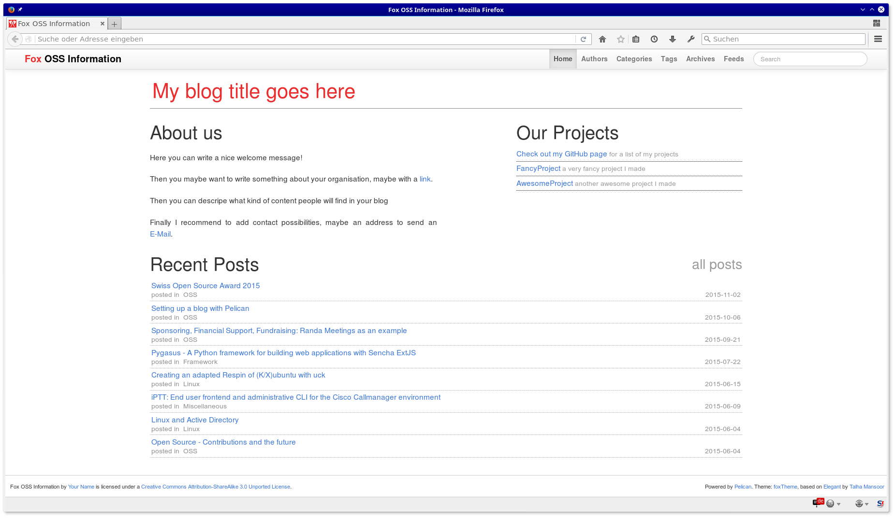
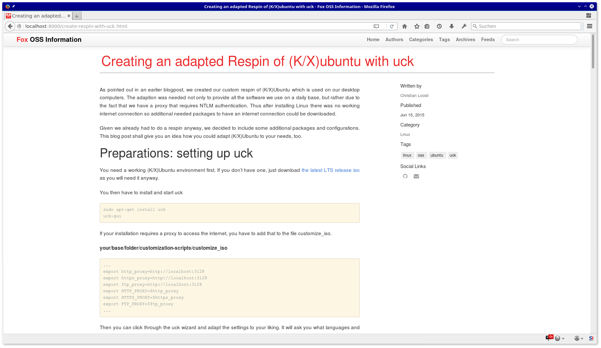
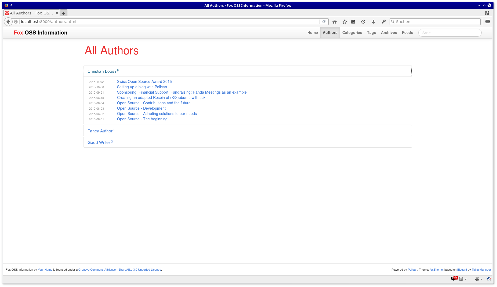
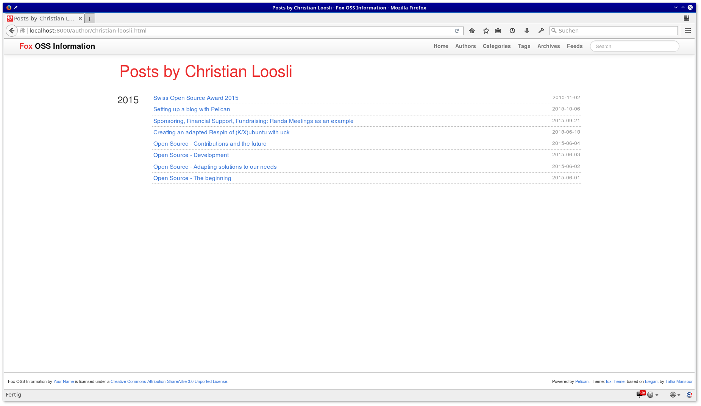
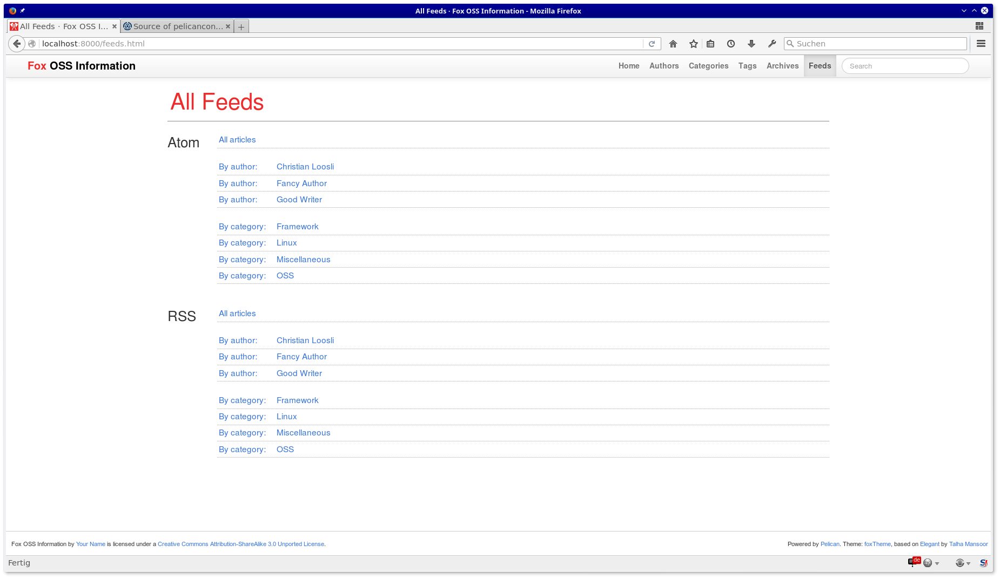

# bbTheme pelican theme

Adapted version of [Elegant - a theme for Pelican](http://oncrashreboot.com/pelican-elegant). 

It offers the same features and configuration options as Elegant, thus including search, live filter, collapsible comments, Mailchimp, custom 404 page, etc. It is a minimal, and stylish theme that looks amazing across all screen resolutions and devices.

# Configuration

See the official [pelican documentation](http://docs.getpelican.com/en/latest/settings.html) for supported settings.
Note that the article summary is not used in that theme.
See the [Elegant blog post by the author of the original theme](http://oncrashreboot.com/elegant-best-pelican-theme-features) for additional settings.

# Added features compared to Elegant

* [Piwik](http://piwik.org/) integration, set PIWIK_URL and PIWIK_SITE_ID in your [settings](http://docs.getpelican.com/en/latest/settings.html)
* Authors and author pages, the former linked in the top navigation bar
* List the authors in the metadata sidebar of articles, links to author page
* Included [swipebox](https://github.com/brutaldesign/swipebox), add the swipebox css class to images you want to enable it for
* Include a nice list of feeds. Only supports categories, authors and all articles, feel free to add others
* Included an easter egg based on [raptorize](http://zurb.com/playground/jquery-raptorize) and [konami-js](http://konami-js.googlecode.com/)

# Removed features compared to Elegant

* Removed the table of content in articles as it was taking too much space for us

# Changes

* Adapted colours and fonts to match a former organisations colours
* Pulled all external dependencies (fonts, js, css) in locally 
* Adapted wordings and minor formattings

# Screenshots

Home page:

Article:

Authors:

Author page: 

Feeds page:

